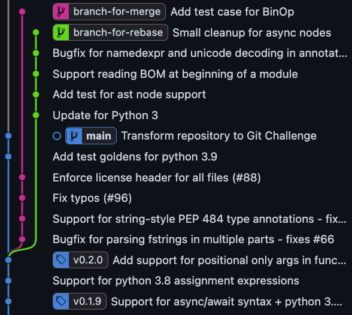
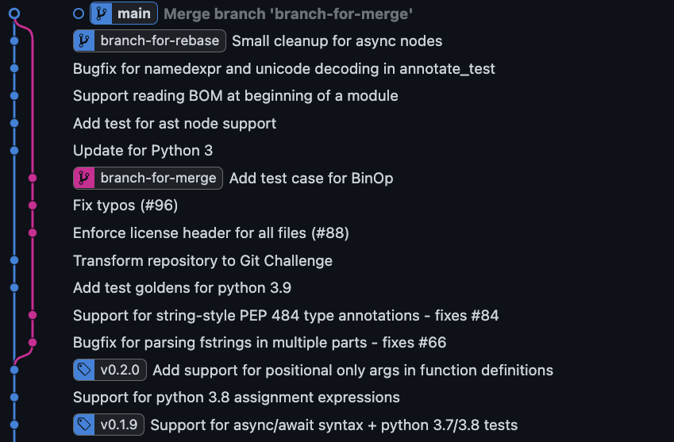

# CS350 Assignment 3: Git Challenge

## Requirements 
You need to have git installed on your machine, and ensure that you are using Python version 3.8 when you execute the test (via the command `python setup.py test`).

Before starting your tasks, please verify that all tests pass on the initial HEAD of the main branch (commit 719c1b13: "Transform repository to Git Challenge"). Use the command `python setup.py test` to run the tests. The output should resemble the following:
```
...
test_simple_function_def (pasta.base.test_utils_test.CheckAstEqualityTest) ... ok
test_two_globals (pasta.base.test_utils_test.CheckAstEqualityTest) ... ok

----------------------------------------------------------------------
Ran 239 tests in 0.128s

OK (skipped=23)
```

## Task 1: Rebase, or Merge 
In this task, you will be asked to rebase or merge two branches, `branch-for-merge` and `branch-for-rebase`, into the `main` branch. 



Specifically, starting from the status shown in the above figure, you are going to bring the changes in `branch-for-merge` and `branch-for-rebase` into the `main` branch using both `git rebase` and `git merge`. The final status should look like the following figure.



Note that some commits are *reordered* during the transformation.

## Task 2: Find a Bug Inducing Commit
After you have completed the first task, you will find that the command `python setup.py test` will fail on the main branch (merge commit). Your task is to find the commit that introduced the bug, and add a fix commit that reverts the bug inducing change, using `git revert`.

* Hint 1: `git bisect` is your friend. (See also: https://git-scm.com/docs/git-bisect)
* Hint 2: The commit tagged `v0.1.9` does not contain the bug. You can safely assume that the bug was introduced after this commit.
* Hint 3: `git cherry-pick -n <commit_hash>` applies a change contained in the commit without *committing* it.
* Hint 4: The commit with the message "Add test case for BinOp" contains the change that adds the test case failed by the target bug.

You'll get a bonus point if you write a script named `./auto_test.sh` to automate `git bisect`, and include the file in your final commit.